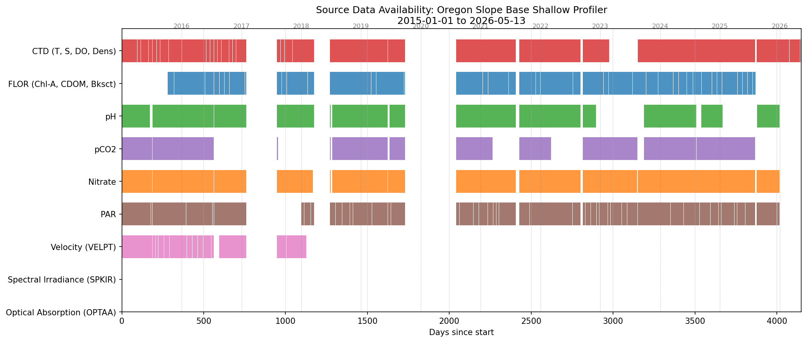

# File System and Workflow

This document describes the repository and data file system layout, and the
end-to-end workflow from data ordering through analysis mirroring (Tasks 0–6).
For sensor details referenced here, see `SensorReference.md`.


## file system


This section describes both the repository (code + markdown) file system 
at `~/argosy` and the associated data file system at `~/ooi`.


- As noted `~/argosy` is the WSL location of this repository.
- We do not want the repo folder to include data files.
- The root folder for data is in the WSL filesystem at `~/ooi`
- The "high resolution" or "raw" data from OOINET resides in a subfolder `ooinet`
- The sub-folder of `ooinet` is `rca`
- This is further divided by sites: Axial Base, Oregon Offshore and Slope Base
- Our initial focus is the Slope Base shallow profiler
- Most shallow profiler instruments have one or more scalar sensors
    - This means the sensor records one measurement for each timestamp
    - These data go in the site name's `scalar` subfolder
- There are three exception instruments producing multiple values for each timestamp
    - These are velocity, spectral irradiance and a spectrophotometer
    - These data go in the `vector` subfolder
- The actual data files are in subfolders of `scalar` / `vector`
    - These subfolders are named by year and instrument type, as in `<yyyy>_<instrum>`
    - Example: Nitrate data for 2016 has folder name `~/ooi/ooinet/rca/SlopeBase/scalar/2016_nitrate`
    - The instrument abbreviations are standardized in the **Sensor Table** (see `SensorReference.md`)
- The NetCDF raw data files are sharded into the `redux` dataset
    - The redux data folders are also found within the `~/ooi` master data folder
- Several approaches to post-processing are possible, numbered 01, 02, ...
    - This operates on sharded (redux) data with results > `~/ooi/postproc/pp<NN>`
- Data analysis methods operate on `redux` or `postproc` versions of the data
    - Results are written to `~/ooi/analysis/<subfolder>`
    - So far there are two: `analysis/clustering` and `analysis/sga`
        - `sga` refers to spectral graph analysis
- Profile Indices provided by the RCA data team reside in `~/ooi/profileIndices`
- Visualizations (typically pngs produced from charts) reside in `~/ooi/visualizations/`
    - The intent here is to set up category subfolders


The following is a schematic of the `argosy` and `ooi` file systems consistent with
the bullet breakdown above. 


```
~  -----  argosy is the respository for the Jupyter Book
                 home directory `~/argosy` is used for working scripts and markdown
                 ----- chapters subfolder: Jupyter Book chapters
 
~  -----  ooi is the root data folder
              ----- ooinet
                           ----- rca
                                     ----- AxialBase
                                                     ----- (follow pattern of SlopeBase)
                                     ----- OregonOffshore
                                                     ----- (follow pattern of SlopeBase)
                                     ----- SlopeBase
                                                     ----- scalar
                                                                  ----- <year>_<instrument>
                                                                  ----- ...etcetera: many of these
                                                     ----- vector
                                                                  ----- <year>_<instrument> (vel, irr, oa, ba)
                                                                  ----- etcetera many of these
              ----- profileIndices (metadata timestamps for profile ascent/descent intervals)
              ----- metadata (other (derived) metadata; do not collide with the profileIndices repo)
                          ----- README.md
              ----- redux 
                          ----- redux2014
                          ----- redux2015
                          ----- redux2016
                          ----- and so on through 2026
                          ----- redux2026 note redux<yyyy> holds many many (small) NetCDF data files
              ----- postproc
                             ----- pp01
                             ----- pp02
                             ----- pp03
                             ----- pp04
                             ----- and so on as methods develop
              ----- analysis 
                             ----- sga for spectral graph analysis 
                             ----- clustering
                             ----- and so on for other methods
              ----- visualizations
                             ----- depth histograms, profile duration histograms, etcetera
              
```


Note: Under the "umbrella expansion" topic the only steps so far are looking into the National Data Buoy Center
data. Results are temporarily in `~/argosy/NDBC`. Pursue this further: Expand the folder structure in `~/ooi`.


Note: In `~/argosy` there are some residual files that need to be sorted. For example `tmld` is an acronym
for 'temperature mixed layer depth'. This was an experiment in human-generated data by means of interactively
clicking on profile charts. It is in Python because the interactive features were not working in the IPython
notebook. The files are moved to a temporary folder `~/argosy/TMLD`.


## Source Data Coverage

The following chart shows presence/absence of source data files by instrument
across the full timeline. Generated by cell 5 of `DataDownload.ipynb`.




## workflow


Tasks:


- (0) Manual data order through browser interface
- (1) Automated: Data download (script)
    - Data comes from the OOINET server, 'ready' notification by email
    - URLs copied into download script: See `~/argosy/chapters/DataDownload.ipynb`
    - Data > localhost `~/ooi/ooinet/rca/Site/{scalar or vector}/<year_instrument>/fnm.nc`
    - Additional step: Scan for and delete superfluous (time-overlap) data files
- (2) Automated: Sharding from above source/raw files to `~/ooi/redux/redux2018/etcetera`
    - These NetCDF shard files are sorted by profile sequence and sensor (not instrument)
    - Hence the CTD instrument produces 4 shard sensor types:
        - Temperature, Salinity, Density, Dissolved Oxygen (with time and depth)
        - The naming system post-raw-files is tied to the **Sensor Table** (see `SensorReference.md`)
    - Other instruments produce one or more shard sensor datasets
        - Again see the **Sensor Table** for more elaboration
        - Most instruments produce 'single value per observation' data
            - These I refer to as *scalar* sensors
        - Exception: Four instruments produce multiple-value observations
            - For: velocity, spectral irradiance, optical absorption and beam attenuation
    - See `~/argosy/chapters/DataSharding.ipynb`
    - Some sensors are activated only during local-midnight and local-noon profiles
        - To identify when these happen there is a code block added to `DataSharding.ipynb`
        - This cell generates CSV files for midnight profiles and for noon profiles
- (3) Automated: Post-processing
    - Shard files are evaluated based on various criteria
        - Example: profile signal is kinked at the bottom or top of the profile
        - Example: various filtering strategies to try and reduce noise etc
        - A given post-processing strategy is assigned a two-digit number NN: 01, 02, ...
    - Post-processing results written to folders `~/ooi/postproc/pp<NN>`
- (4) Interactive: Visualizations
    - Bundle charts, Curtain plots, Animations etcetera
- (5) Interactive: Analysis
    - Spectral graph analysis
    - Clustering
    - And so on: Methods described in `~/argosy/Analysis.md`
- (6) Mirror data to S3
   

Some elaboration on these tasks follows.


### Task 1: Data Download


#### Order datasets from OOINET ('task 0, manual')


- Log in to OOI [access page](https://ooinet.oceanobservatories.org/data_access) with an established account
- LHS filters: Array, Cable, Platform, Instrument
- Data Catalog box (bottom center)
    - ***Do not try and use the time window interface***
    - ***+*** Action button: Download table appears top center
        - Also: Data availability plot, center center
    - Top center: Download button generates a data order
        - ***Select datasets with Stream type == `Science`***
        - > Pop up to finalize order
            - Calendars: Type in time range manually e.g. `2015-01-01 00:00:00.0`
            - Optional:
                - Un-check the box for **Download All Parameters**
                - Use ctrl-click to select parameters of interest
            - Submit the order
            - "Order ready" email sent to account usually < 2 hours


#### Download data order


Task 0 results in an email with URLs to the OOINET data server directory. 
The download retrieves NetCDF files from that OOINET staging area. 
Retrieval / management code is in notebook `DataDownload.ipynb`.


An OOINET filename example:


`deployment0004_RS01SBPS-SF01A-2A-CTDPFA102-streamed-ctdpf_sbe43_sample_20180208T000000.840174-20180226T115959.391002.nc`


Breakdown of this filename (partially understood):


- `deploymentNNNN` refers to the fourth operational phases; each deployment typically months to a year in duration
- `RS` identifies the Regional Cabled Array
- `01` TBD
- `SB` refers to the (Oregon) Slope Base site
- `PS` is "Profiler (Shallow)" i.e. the Shallow Profiler at the Oregon Slope Base site
- `SF` TBD
- `01A` TBD
- `2A` TBD
- `CTDPF` is a CTD instrument (multiple sensors)
- `A102` TBD
- `streamed` TBD
- `ctdpf` is a second (lower case) reference to the CTD
- `sbe43` TBD
- `sample` TBD
- `20180208T000000.840174-20180226T115959.391002` is a UTC time range for the sensor data in this file
- `.nc` indicates file format is NetCDF


This data file combines together multiple sensors plus associated engineering and quality 
control data. This example includes data from 157 cycles of the shallow profiler: ascent,
descent, rest. These source files are dense amalgams of information that can be overwhelming 
to work with.


Massive download jobs are subject to interruption so we want the code to be tolerant of
re-starting after only partial completion. Here is the code spec; should run in a single
Jupyter cell in the `DownloadData.ipynb` notebook.

    
- Open a file `~/argosy/download_link_list.txt`
    - Each line is a URL for a distinct data order
        - For each URL print a diagnostic of 
            - how many `.nc` files are present
            - how many have already been downloaded
            - how many remain to download
    - At that URL is a collection of files to download
- We want to download files that are not yet fully downloaded; otherwise skip
- Files are to be downloaded to the corresponging localhost destination folder
    - The base localhost folder location is `~/ooi/ooinet/rca/SlopeBase/scalar/<yyyy>_<instrument>`
    - If a destination folder does not exist: Print a message and halt
    - The destination folder name `yyyy` value is a year from 2014 to 2026
    - `<instrument>` is taken from the **Sensor Table** (see `SensorReference.md`)
- To determine the destination folder for a particular `.nc` file: 
    - Parse the `.nc` filename as:
    - `<first_part>_yyyyMMddTHHmmss.ssssss-yyyyMMddTHHmmss.ssssss.nc`
        - This maps to `<first_part>_datetime-datetime.nc`
        - The first datetime: year `yyyy` month `MM` day `dd` literal character `T`...
            - ...followed by hour `HH` minute `mm` second `ss.ssssss`
        - Second datetime follows the same format.
    - Destination folder `yyyy` is chosen as the same `yyyy` as the first datetime.
- Download the `.nc` NetCDF files and ignore the `.ncml` files
    - Some downloaded files will have a time dimension that crosses the year boundary


#### Degenerate source / raw data files


Cells 2 and 3 of `~/argosy/chapters/DataDownload.ipynb` address redundancy in source data files. 
Together they eliminate any source / raw data files with time ranges that are covered by other 
source / raw data files for the same instrument. The particular focus in on CTD files that are
delivered (by default) along with other instrument files. So if we download pH and pCO2 and 
nitrate files we may accidentally download multiple copies of the simultaneous CTD files. 


The process is simplified by the source / raw data files containing their time range in the
filename itself. 


The code in cell 2 of `DataDownloads.ipynb` looks for files with time range bounded by other
(single) files and creates a script to delete them . The code in cell 3 of `DataDownloads.ipynb` 
looks for files with time range bounded by multiple other files and creates a script to 
delete them. 


### Task 2: Data Sharding


It will prove convenient to 'shard' (break up) source files by sensor type and by 
individual profile; and then to compartmentalize shards by year (folder name `redux<YYYY>`).
Code for this and related operations is in `DataSharding.ipynb`.


One output file (a shard) corresponds to one profile and one sensor type, for example temperature 
data. Most profile data is acquired on ascent (as the sensor intrudes upward into undisturbed
water). There are a couple of exceptions, pCO2 and pH. Many profile files (shards) are written 
to `redux` folders labeled by year. Each single-sensor profile shard file is about 100kb in 
comparison with source files that are typically 500MB. Multiple sensor types are written to
the same 'by year' folder.


Shard folder name example: `~/ooi/redux/redux2018`


Shard filename example: `RCA_sb_sp_temperature_2018_296_6261_7_V1.nc`


Breakdown of this filename:


- `RCA` = Regional Cabled Array
- `sb` = (Oregon) Slope Base
- `sp` = Shallow Profiler
- `temperature` = sensor type
- `2018` = year of this profile
- `296` = Julian day of this profile
- `6261` = global index of this profile (see `profileIndices` in `ProfileSharding.md`)
- `7` = daily index of this profile, a number from 1 to 9
- `V1` = version number of this shard operation
- `.nc` = file type NetCDF


The version number for sharding anticipates future improvements, for 
example using QA/QC metadata to evaluate usability of a particular profile.


#### midnight and noon profiles


Some sensors are activated only during local-midnight and local-noon profiles.
The `DataSharding.ipynb` notebook identifies these profiles and generates CSV files.
See `ProfileSharding.md` for the detailed midnight/noon profile table and CSV file locations.

### Task 3: PostProcessing


This is pending work. Considerations include:


- Reducing the collection of analysis datasets based on additional criteria, e.g. QA/QC
- Noisy data at the top of a profile; proximity to the surface / wave action
- Low-pass filters applied along the depth axis
- Hi-pass filters that preserve transients ('hypothetical thin layers')
- Automated anomaly detection and search for coincidence
    - An excursion feature for a sensor persists over multiple profiles
    - An excursion feature for a sensor matches one for another sensor


A given postprocessing strategy is developed and applied to redux/shard data to produce
a new dataset in one of the `~/ooi/postproc` folders: `pp01`, `pp02` etcetera.

### Task 4: Visualizations


Working from sharded data build out both interactive visualizations and data 
animation generators. Code for this and related tasks is in `Visualizations.ipynb`.
See `VisualizationNotes.md` for detailed visualization documentation.


### Task 5: Analysis

No text for this yet.

### Task 6: Mirror localhost data to S3


The `~/ooi` data tree is mirrored to the S3 bucket `s3ooi` for reproducibility and
portability (e.g. rebuilding the pipeline on an EC2 instance).

**Bucket:** `s3://s3ooi/`

**Prefix structure mirrors localhost:**
```
s3://s3ooi/ooinet/rca/SlopeBase/scalar/...    (source data)
s3://s3ooi/ooinet/rca/SlopeBase/vector/...    (source data)
s3://s3ooi/profileIndices/...                  (profile metadata)
s3://s3ooi/metadata/...                        (derived metadata)
s3://s3ooi/redux/redux2015/...                 (sharded profiles)
s3://s3ooi/postproc/pp01/...                   (post-processed subsets)
s3://s3ooi/visualizations/...                  (charts)
```

**Sync commands (run individually to control what gets uploaded):**
```bash
aws s3 sync ~/ooi/ooinet/ s3://s3ooi/ooinet/
aws s3 sync ~/ooi/profileIndices/ s3://s3ooi/profileIndices/
aws s3 sync ~/ooi/metadata/ s3://s3ooi/metadata/
aws s3 sync ~/ooi/redux/ s3://s3ooi/redux/
aws s3 sync ~/ooi/postproc/ s3://s3ooi/postproc/
aws s3 sync ~/ooi/visualizations/ s3://s3ooi/visualizations/
```

**Reconstruct on a new machine (e.g. EC2):**
```bash
aws s3 sync s3://s3ooi/ ~/ooi/
```

**Notes:**
- `aws s3 sync` is incremental: it only transfers files that are new or modified
  (compared by size and last-modified timestamp). Re-running the same command after
  an interruption or after adding new data files will pick up where it left off
  without re-uploading unchanged files.
- Sync source data (`ooinet/`) before or during sharding — it reads from `ooinet/`
  and writes to `redux/`, so there is no conflict.
- Sync `redux/` only after sharding completes to avoid uploading partial results.
- The legacy bucket `epipelargosy` is retired; `s3ooi` is the single mirror target.


## raw data filenames
    
Example: `deployment0004_RS01SBPS-SF01A-2A-CTDPFA102-streamed-ctdpf_sbe43_sample_20180208T000000.840174-20180226T115959.391002.nc`
    
- `Deployments` last months or as much as a year between maintenance events
- `RS01SBPS` is a reference designator
    - `RS` is Regional Cabled Array
    - `01` ?
    - `SB` is Slope Base
    - `PS` is (reversed) shallow profiler
- `SF01A` is the profiler (not the fixed platform)
- `2A` ?
- `CTDPFA102` is CTD data
- ?
- `20180208T000000.840174` is the data start time
- `20180226T115959.391002` is the data end time (Zulu)
- .nc is NetCDF
The NetCDF file will have `data variables`, `coordinates`, `dimensions` and `attributes`.
The default Dimension is Observation `obs`. The Dimension we want to use is `time`.
This is done using an `xarray`: `swap_dims()` method on the `xarray` `Dataset`:


```
ds = ds.swap_dims({'obs':'time'})
```

- `data variables` include sensor data of interest and QA/QC/Engineering metadata
- `coordinates` are a special type of data variable
    - natively the important coordinates are `obs`, `depth` and `time`
    - there is also `lat` and `lon` but these do not vary much for a shallow profiler
- `dimensions` are tied to `coordinates`: They are the data series reference
- `attributes` are metadata; can be useful; ignore for now
